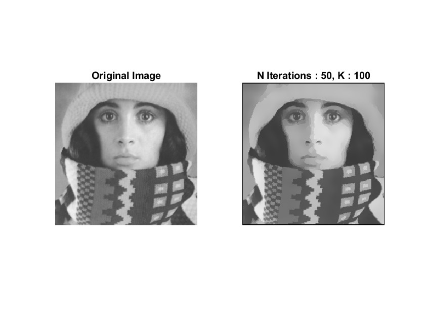
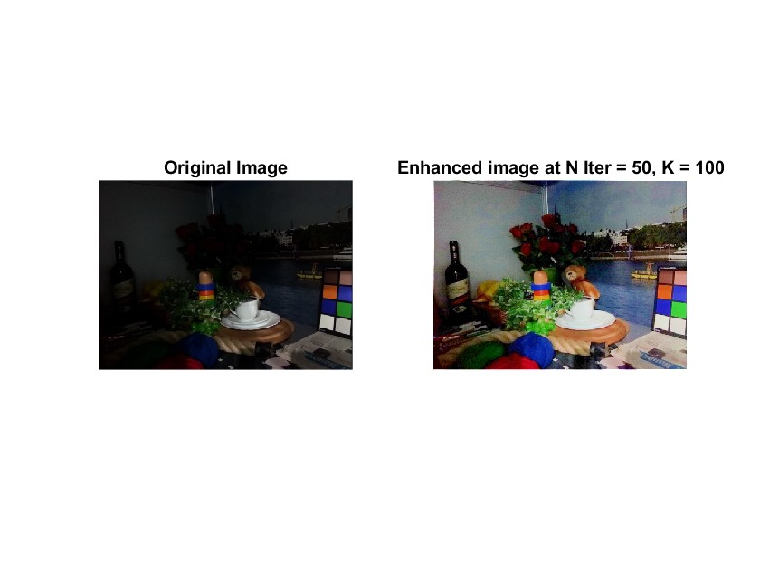

# Image_Processing_Techniques
This project makes use of the following image processing techniques such image smoothing technique, low light enhancement and removal of ripples.

## Installation 
`Matlab 2022 or above `

# Guide
The `image_smoothing.m` is a simple matlab code to smoothen an image  

The `light_enhancement.m` is a simple matlab code to enhance the lighting of an image  

The `remove_ripples.m` is a simple matlab code to remove ripples from an image.

